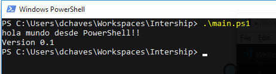
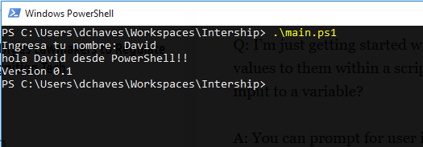

# Git Challenge

Welcome!

In this challenge you are going to understand first-hand the flow of work that Endava uses with Git, the famous GitFlow!! To understand this flow we are going to simulate the steps using a simple script using Bash, PowerShell or CMD and in pairs, we are going to simulate the process for GitFlow.

And the end of the challenge, your project **must have** the following characteristics:

1. Master and develop branches.
2. History of merged branches onto develop and master.
3. Rebased commits from the master and develop onto the feature branches

## Create a new remote project

On of you will create a new project on Github and it will created and will grant access (and write/commit permissions, obviously) to your mate. Also, you need to protect the master branch for accidental delete and must protect the master from comits (only the owner of the repo should be able of commiting and merging into the master branch)

## Local project configuration

Ok guys, so first challenge, configure your local project in a new folder with the following:

1. Names and last name as the username on at **project level**, not machine level.
2. Using the email which you use to register on Github as the username email.
3. Adding the GitHub project as the default *remote*.

## Initial commit

Now, with the project rightly configured you will create a file that will output the following:

And you will make commit and push of this file!

## Develop Branch

The most important branch it's the **develop** branch (o **development**), this branch it's going to have all the code to be ready to production.

Know, the owner of the repo will create the branch and the other user will download the remote branch to his local.

## Feature branches

Now, our program it's quite simple, so let's improve it! We are going to add to new functionalities:

- Print the username.

- Print the OS version.

Each one of you will be in charge of both features, you will need to create two feature branches.

**Tip:** the branches should start with the prefix *feature/*

## Merging

So, we will plan to release our first version onto production! For this you will need merge one of your feature branches onto develop and then on master.

Tip: read about *pull requests* on Github.

## Master release

Now we can *promote* our release to our first version! For this we will create a new *release* branch in the format `release/[version]` and tagged on master.

Tip: read about [Semantic Versioning](https://semver.org/) and Git tags.

## Hotfix

Great! our program it's on production (well, in theory at least) however, did the output of the version program matches the tagged version on the repo? If don't, will you need to create a *hotfix* branch on the repo, fix the issue and then *release it*.

## Upstream update

Now that those changes are on master, you need to implement those *upstream changes* onto your feature branch using rebase.

Tip: look at the images.

Before Rebase

After Rebase

## Final release

We are closing to the end of the Challenge little Padawans! Now you will implement the last feature (showing the OS Version) using the same steps and all the stuff that you just learn! ;)

## Bonus feature

Have you ever used curl? what about trying to output the real IP public address on the command line too?

Tip: go to [www.cualesmiip.com](www.cualesmiip.com) to check your real IP address.